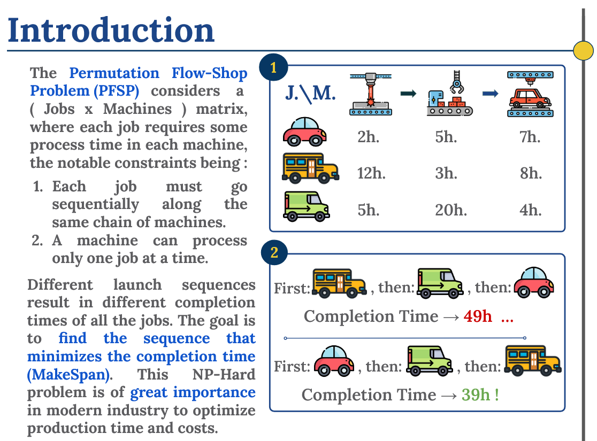

# DL Based Permutation Flowshop Problem

- This Repository Contains My Solution to DL Based Permutation Flowshop Problem in CSE DataHack Competition.

## Introduction

## What is this Challenge About?

The Permutation Flow Shop Problem (PFSP) is a classic optimization challenge that has seen various solution approaches over the years, from heuristics to metaheuristics and hyper-heuristics. Despite extensive research, PFSP remains challenging, particularly for large-scale instances with numerous jobs and machines.

Recently, deep learning (DL) has emerged as a powerful tool for handling complex, high-dimensional data spaces. This has led researchers to explore DL applications in solving PFSP, either by combining it with traditional heuristics or developing pure DL approaches.

## Challenge Requirements

The challenge focuses on developing a deep learning solution for the Permutation Flow Shop Problem:

- Work with 24 problem instances
- Instance configurations:
  - Jobs: 10, 20, 50, or 100
  - Machines: 5, 10, or 20
  - Two instances per configuration

Resources provided:

- Python matrices for all instances in `datahack_2025_flowshop.ipynb`
- Makespan calculation function included

## Solution

This solution implements a hybrid approach combining deep learning with local search optimization to solve the flow shop scheduling problem. The goal is to minimize the makespan (total completion time) across multiple job instances with varying numbers of machines.

### Solution Approach

1. **Deep Learning Core**
   - Uses a Transformer-based neural network to learn job scheduling patterns
   - Employs multiple attention heads to capture complex relationships between jobs
   - Model generates initial job sequences based on learned patterns

2. **Optimization Layer**
   - Enhances neural network solutions with local search optimization
   - Uses tabu search with simulated annealing for better exploration
   - Implements multiple neighborhood structures (swap and insert moves)

3. **Ensemble Strategy**
   - Combines predictions from multiple models
   - Uses temperature sampling for diverse solution generation
   - Aggregates results to find the best possible sequences

### Key Features

- Adaptive learning rates and batch processing
- Instance-specific optimization
- Efficient handling of different problem sizes (10-100 jobs, 5-20 machines)
- Score calculation based on weighted makespan pairs

### Requirements

- PyTorch
- NumPy
- CUDA support (optional, for GPU acceleration)

### Contributions

- Contributions are welcome, feel free to submit a PR or open an issue.

### Author

[1farz1](github.com/1farz1)
